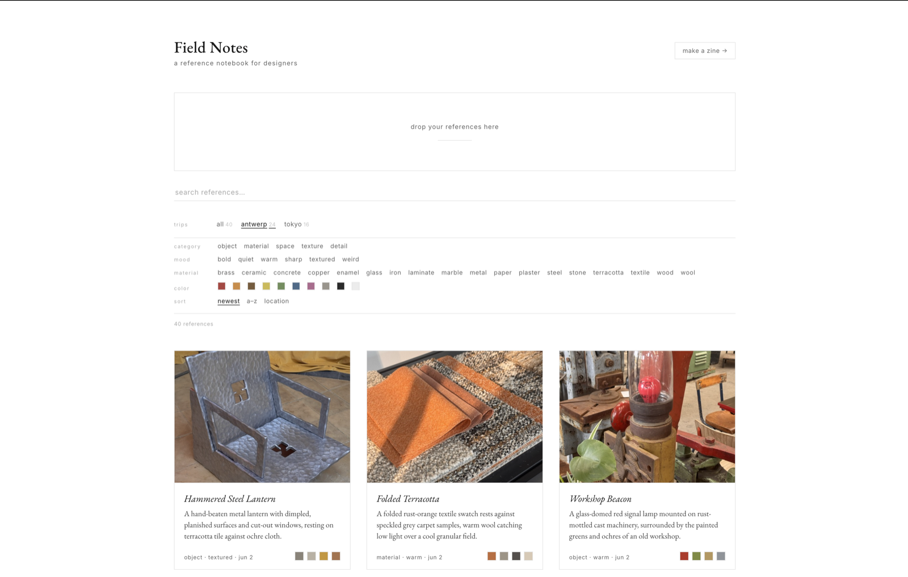

# field notes

a local reference notebook for designers. drop travel photos in, and Claude names
each one, samples its palette, and tags the materials — then files it into the trip
it came from. everything lives on your own disk. no account, no cloud, no upload.

<!-- screenshots: drop 1–2 images in ./docs and update these paths -->
<p align="center">
  
  
</p>

> 🎬 **watch the 60-second demo:** [instagram reel →](INSTAGRAM_REEL_LINK_HERE)

---

## what it does

- **drop a photo, get a card.** Claude looks at each image and writes a short
  name, a one-line description, an accurate hex palette, and the materials it sees.
- **sorts itself by trip.** location + date are read straight from the photo's
  EXIF (GPS → city), so shots file into "Antwerp", "Tokyo", etc. automatically.
- **prints to a zine.** select a few cards and fold them into a single-sheet
  mini-zine (one cut) or a saddle-stitch booklet, ready for the printer.

## how it works

- **tagging** runs through your local **`claude` CLI** (Claude Code) using your
  existing login — there's no API key to manage. each image is analysed in
  headless mode and comes back as a small JSON record (name, palette, materials).
- **image work** is all server-side via macOS's built-in **`sips`** (HEIC→JPEG,
  downscaling) and **`mdls`** (EXIF). nothing flaky in the browser, no image libs.
- **persistence** is just files: full-res originals in `./library/`, metadata in a
  human-readable `./library.json` you can back up, commit, or hand-edit.
- **zero dependencies.** the whole thing is one `server.js` (Node's `http`) and one
  `index.html` (vanilla JS). no framework, no build step, no `node_modules`.

## why i built it

<!-- draft in your voice — rewrite this until it sounds like you -->

i come back from every trip with a camera roll full of the same kinds of things:
a wall, a doorway, a stack of tiles, the exact orange of a café sign. references.
the problem was never taking them — it was everything after. they'd sit in my phone,
unsorted and unnamed, and by the time i wanted one i couldn't find it. pinterest felt
like someone else's feed; a folder of photos felt like a junk drawer.

so i built the tool i actually wanted: drop a photo in and it gets a name, a palette,
and the materials it's made of, then files itself by the trip it came from — no tagging,
no accounts, nothing leaving my laptop. it started in antwerp during design week, where
i was photographing more than i could keep track of, and grew from there. this is that
tool, opened up so anyone can run their own.

## setup

requires **Node 18+** on **macOS** (it leans on the built-in `sips`/`mdls` tools).
the easiest path also uses the **`claude` CLI** — if you already use
[Claude Code](https://claude.com/claude-code), you're set; no API key needed.

```bash
# 1. clone
git clone https://github.com/YOUR_USERNAME/field-notes.git
cd field-notes

# 2. dependencies — there are none to install (zero-dependency Node app)

# 3. (optional) configure
cp .env.example .env      # only if you want to use an API key instead of the CLI

# 4. run
node server.js
```

then open **http://localhost:4317** and drag photos onto the page. a fresh clone
starts with a few demo reference photos so the grid isn't empty.

**two ways to authenticate the image analysis:**

1. **the `claude` CLI (recommended, no key).** install Claude Code, log in once,
   and Field Notes shells out to it. nothing to configure.

2. **an Anthropic API key (fallback).** if you'd rather not use the CLI, get a key
   at **[console.anthropic.com](https://console.anthropic.com)** (→ *API keys* →
   *Create key*), then put it in your `.env`:
   ```
   ANTHROPIC_API_KEY=sk-ant-...
   ```
   the server uses the key only when the CLI isn't available.

### other options

```bash
PORT=5000 node server.js                       # run on a different port
FIELD_NOTES_MODEL=claude-sonnet-4-6 node ...   # pin a specific model
CLAUDE_BIN=/full/path/to/claude node ...       # if `claude` isn't auto-found
```

## tech stack

- **Node.js** (zero dependencies — just the standard library)
- **vanilla HTML / CSS / JS** — no framework, no build step
- **Claude** for image analysis, via the **Claude Code CLI** (or the Anthropic API as a fallback)
- **macOS `sips` + `mdls`** for image conversion, downscaling, and EXIF
- self-hosted **EB Garamond + Inter** webfonts (works fully offline)

## project layout

```
field-notes/
  server.js          zero-dependency Node server; calls the `claude` CLI
  index.html         the whole interface (vanilla JS)
  samples/           demo photos + metadata a fresh clone seeds from
  fonts/  icons/     self-hosted webfonts and app icons
  library/           your full-res originals      (git-ignored, auto-created)
  library.json       your collection's metadata   (git-ignored, auto-created)
  .cache/            scratch for downscaled copies (git-ignored, auto-cleared)
```

## what i'd do next

<!-- draft — swap in your own ideas -->

a running list, roughly in order of how much i want them:

- make it work beyond macOS (it currently leans on the built-in `sips`/`mdls`)
- group by material or colour across trips, not just by location
- a "palette from a whole trip" view — the dominant colours of antwerp vs tokyo
- export a trip as a single shareable page or PDF, not only a printed zine
- let two photos sit side by side to compare materials directly

## credits

built with [Claude](https://claude.com/claude-code). started during, and inspired
by, **Antwerp Design Week**.

by **Laurence Mac Donald** — [@by.laurence on instagram](https://instagram.com/by.laurence).

## license

[MIT](LICENSE) © Laurence Mac Donald
